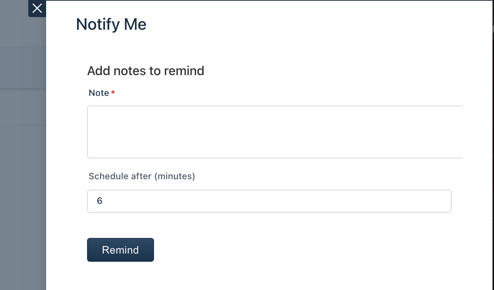
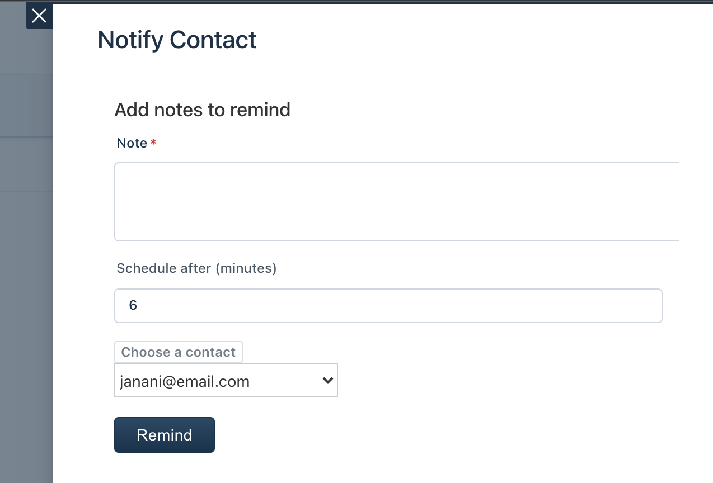

# Notes Reminder App

## Description

- Remind Me: You can add a note and set a reminder so that app will remind your note(email) after a set period of time as scheduled.
- Remind Contact: You can remind any contact with a note so that app will remind the contact(email) after a set period of time as scheduled.

App uses Request method to POST payload to send Email API (Email service)

## Screenshots

  
 App Screenshots 

<em>Configuration page: Auth settings </em>

<em>Configuration page: Email settings </em>

<em>App: </em> 

<em>Modal: Remind me</em>

<em>Modal: Remind Contact</em>

## Features Demonstrated

App location: ticket_sidebar on ticket details page

| Feature                                                                                          | Notes                                                                                                                                         |
| :---:                                                                                            | ---                                                                                                                                           |
| [`Data Storage API`](https://developers.freshdesk.com/v2/docs/data-storage/)                     | Data storage API is used to store settings                                                                                                    |
| [`Interface API`](https://developers.freshdesk.com/v2/docs/interface-methods/)                   | Interface APIs is used to power the notifications, open modal                                                                                 |
| [`Instance API`](https://developers.freshdesk.com/v2/docs/instance-method/)                      | Interface APIs is used to power the notifications, open modal                                                                                 |
| [`SMI`](https://developers.freshdesk.com/v2/docs/server-method-invocation/)                      | Server Method invocation (SMI) is used to invoke _createSchedule_ serverless component when _Remind me_ or _Remind contact_ button is clicked |
| [`Custom Installation Page`](https://developers.freshdesk.com/v2/docs/custom-installation-page/) | to validate API key and dynamically populate dependent fields (email configs) |
| [`App Setup Events`](https://developers.freshdesk.com/v2/docs/app-setup-events/)      | Invoke JS function handlers `onAppInstall`

## Prerequisites

1. A trial freshdesk account
2. A properly configured [Development environment](https://developers.freshdesk.com/v2/docs/quick-start/) along with the [FDK (Freshworks Development Kit)](https://developers.freshdesk.com/v2/docs/freshworks-cli/)

***

## Procedure to run the app

1. Run the app locally using the [`fdk run`](https://developer.freshdesk.com/v2/docs/freshworks-cli/#_run) command.
2. Go to Freshdesk, navigate to the tickets page and select any ticket
3. Refer to the [Test your app](hhttps://developer.freshdesk.com/v2/docs/quick-start/#test_your_app) section of the quickstart guide to allow insecure content.
4. Append `?dev=true` to the URL to see the changes

***

## Additional Notes

- The Scheduled Events feature demonstrated here can only be really tested by uploading it as custom app.
- In local testing, the app runs the Scheduled code irrespective of the time actually scheduled.
- This app when stores the data in db. You can find db in local testing under .fdk/localstore file.
